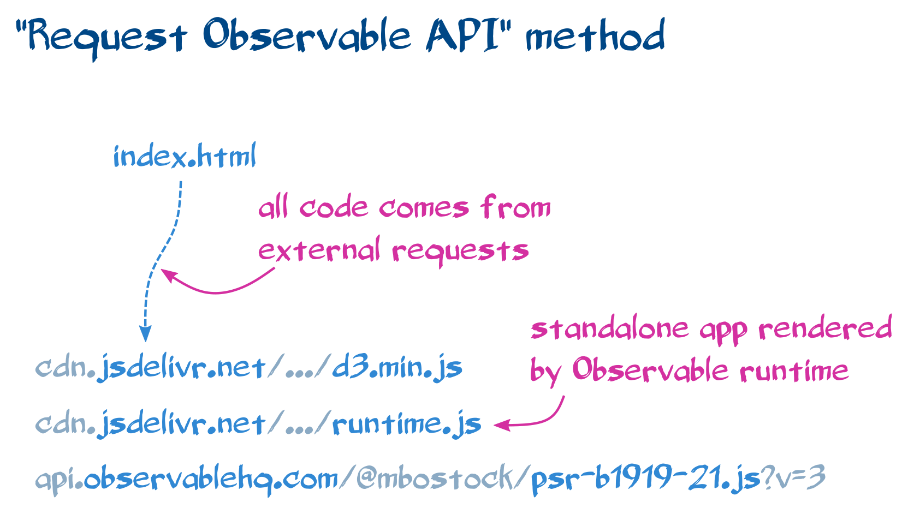
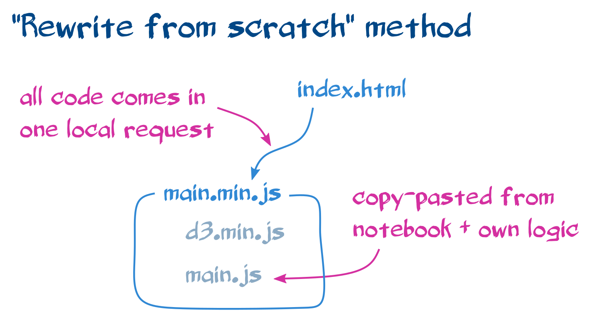

# Observable notebook to standalone application

Various methods to migrate an [Observable](https://observablehq.com) notebook to
a standalone webpage.

## Example notebook

The [joyplot notebook](https://observablehq.com/@mbostock/psr-b1919-21) is used
as an example throughout this repository.

Examine the results of the migration to a standalone application:

- [standalone joyplot](https://joyplot-8a5ibi1av.now.sh/) using the
  ["Bundle" method](./bundle_js_and_deploy)
- [standalone joyplot](https://joyplot-10jbhd7e8.now.sh/) using the trivial
  ["Default Observable export" method](./default_observable_export).
- [standalone joyplot](https://joyplot-96iun3ktp.now.sh/) using the trivial
  ["Request Observable API" method](./request_observable_api).
- [standalone joyplot](https://joyplot-p9qmx1pf3.now.sh/) using the
  ["Rewrite from scratch" method](./rewrite_from_scratch).

## Using ObservableHQ runtime

An Observable notebook can be run as a standalone application using the
[`@observable/runtime` library](https://github.com/observablehq/runtime),
outside of the Observable platform.

The recommended method is to bundle all the modules into a single JavaScript
file, and deploy it to now.sh: ["Bundle" method](./bundle_js_and_deploy)

Other more trivial methods:

- download and extract tgz from Observable notebook to use the default
  index.html file provided in the tgz file:
  ["Default Observable export" method](./default_observable_export)

  

- get JavaScript modules from api.observablehq.com at runtime:
  ["Request Observable API" method](./request_observable_api)

  

## Independent of ObservableHQ runtime

A totally different approach to migrate an Observable notebook to a standalone
application is to rewrite the code from scratch:
["Rewrite from scratch" method](./rewrite_from_scratch)

## References

- ["How-To… Embed an Observable Notebook in your CMS"](https://visionscarto.net/observable-jekyll/):
  notebook cells embedded into a Jekyll blog,
- [Downloading and Embedding Notebooks](https://observablehq.com/@observablehq/downloading-and-embedding-notebooks):
  official Observable documentation,
- [zzzev/observable-press: An opinionated way to publish Observable (observablehq.com) notebooks](https://github.com/zzzev/observable-press):
  an untested alternative method.
