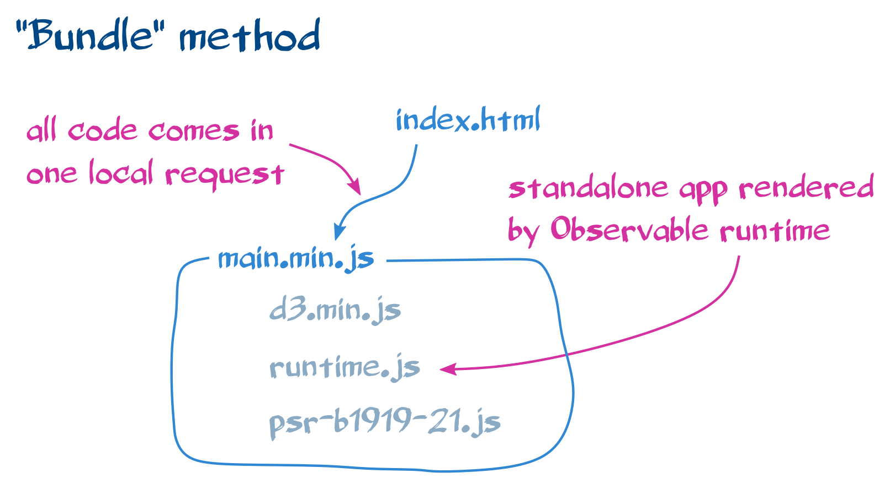

# Method - Bundle

This method allows to generate fewer requests than the
["Request Observable API" method](../request_observable_api/README.md) and to
deploy online, but is more complicated since it requires to manage more files
and concepts.

[](./bundle_js_and_deploy)

## Pros

- generates fewer HTTP requests (the Observable notebook, the
  [runtime.js](https://cdn.jsdelivr.net/npm/@observablehq/runtime@4/dist/runtime.js)
  Observable library and all the "dynamic dependencies" are bundled in a
  minified [public/main.min.js](./joyplot/step6/public/main.min.js) JavaScript
  file)
- allows to render only some cells of the notebook
- deploys to now.sh infrastructure
- supports old browser thanks to Babel (does not require browser
  [compatibility with ES modules](https://developer.mozilla.org/en-US/docs/Web/JavaScript/Reference/Statements/import#Browser_compatibility))

## Cons

- complex: requires knowledge about npm, node.js, ES modules, now.sh, rollup,
  babel, terser
- CSV data still must be downloaded from GitHub. Thus, the application cannot
  run offline.

## Tutorial

See [step_by_step/](./step_by_step/README.md) to read about the details of the
solution. Here we only give the method for quick replication.

Install [node.js and npm](https://nodejs.dev/how-to-install-nodejs).

Create a new npm project:

```bash
mkdir -p joyplot/public joyplot/src
cd joyplot
npm init
```

Install the notebook as a development dependency (the URL is obtained on the
notebook page, clicking on "…" and then on "Download tarball"):

```bash
mkdir -p src/notebook
curl -o /tmp/package.tgz https://api.observablehq.com/@mbostock/psr-b1919-21.tgz?v=3
tar xf /tmp/package.tgz --directory src/notebook
rm /tmp/package.tgz
npm install --save-dev src/notebook
```

Install the Observable runtime module, d3-require, and the libraries imported
from the notebook (cells that make use of `require`):

```bash
npm install --save-dev @observablehq/runtime@4 d3-require@1 d3@5
```

Install the build and deploy tools:

```bash
npm install --save-dev rollup@1 rollup-plugin-node-resolve@5 @babel/core@7 \
                       rollup-plugin-babel@4 rollup-plugin-terser@5 now@16
```

Add the [rollup.config.js](./joyplot/rollup.config.js) file:

```js
import * as meta from './package.json';
import resolve from 'rollup-plugin-node-resolve';
import babel from 'rollup-plugin-babel';
import {terser} from 'rollup-plugin-terser';

export default {
  input: 'src/main.js',
  onwarn: function(warning, warn) {
    if (warning.code === 'CIRCULAR_DEPENDENCY') {
      return;
    }
    warn(warning);
  },
  output: {
    file: `public/main.min.js`,
    name: '${meta.name}',
    format: 'iife',
    indent: false,
    extend: true,
    banner: `// ${meta.homepage} v${
      meta.version
    } Copyright ${new Date().getFullYear()} ${meta.author.name}`,
  },
  plugins: [resolve(), babel(), terser()],
};
```

Add scripts in [package.json](./joyplot/package.json):

```json
"scripts": {
  "build": "rollup -c",
  "deploy": "now",
  "predeploy": "npm run build"
},
```

Create [public/index.html](./joyplot/public/index.html):

```html
<!DOCTYPE html>
<html lang="en">
  <head>
    <!-- Minimal HTML head elements -->
    <meta charset="utf-8" />
    <title>PSR B1919+21</title>
  </head>
  <body>
    <!-- Title of the page -->
    <h1>PSR B1919+21</h1>

    <!-- Empty placeholders -->
    <div id="joyplot"></div>

    <!-- JavaScript code to fill the empty placeholders with notebook cells -->
    <script src="./main.min.js"></script>
  </body>
</html>
```

Create [src/main.js](./joyplot/src/main.js):

```js
// Import Observable notebook
import notebook from '@mbostock/psr-b1919-21';

// Import d3
import * as d3 from 'd3';

// Import d3-require
import {require} from 'd3-require';

// Import Observable library
import {Runtime, Inspector, Library} from '@observablehq/runtime';

// Resolve "d3@5" module to current object `d3`
const customResolve = require.alias({'d3@5': d3}).resolve;

// Render selected notebook cells into DOM elements of this page
// Use the custom resolve function to load modules
const runtime = new Runtime(new Library(customResolve));
const main = runtime.module(notebook, name => {
  switch (name) {
    case 'chart':
      // render 'chart' notebook cell into <div id="joyplot"></div>
      return new Inspector(document.querySelector('#joyplot'));
      break;
  }
});
```

The code can be found in [joyplot/](./joyplot/).

## Usage

Build with

```bash
npm run build
```

Run locally with

```bash
python3 -m http.server --directory public/
```

Deploy on now.sh (see https://joyplot-8a5ibi1av.now.sh):

```bash
npm run deploy
```
