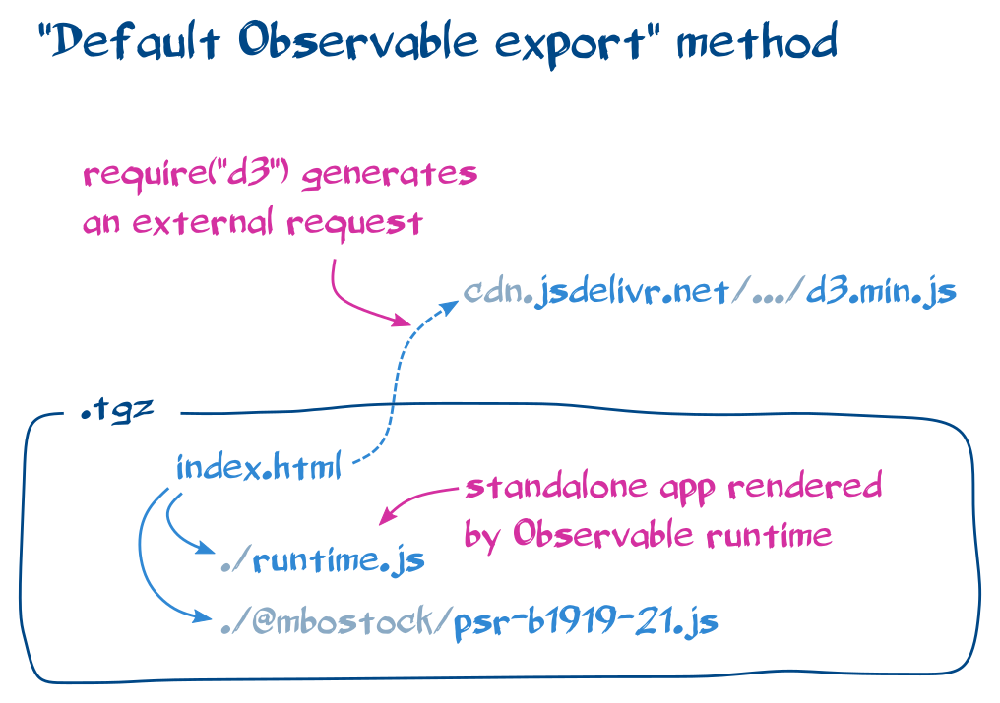

# Method - Default Observable export

This method is the simplest way to "migrate" an
[Observable notebook](https://observablehq.com/@mbostock/psr-b1919-21) to a
standalone webpage.

[](./default_observable_export)

## Install

- Go to the [notebook](https://observablehq.com/@mbostock/psr-b1919-21), click
  on "…" and then on "Download tarball")
- Uncompress the psr-b1919-21.tgz file
- Serve the index.html file with a web server

Using cli:

```bash
mkdir joyplot
curl -o /tmp/package.tgz https://api.observablehq.com/@mbostock/psr-b1919-21.tgz?v=3
tar xf /tmp/package.tgz --directory joyplot
rm /tmp/package.tgz
```

and serve locally at http://localhost:8000 with:

```
python3 -m http.server --directory joyplot
```

or deploy on now.sh (see https://joyplot-10jbhd7e8.now.sh/) with:

```
echo '{"builds": [{ "src": "**/*.{js,html,css}", "use": "@now/static" }]}' > joyplot/now.json; npx now joyplot; rm joyplot/now.json
```

## Pros

- very simple, there is nothing to code or install
- works for any notebooks, independently of it inner complexity (try with
  https://observablehq.com/@fil/tissots-indicatrix or
  https://observablehq.com/@jashkenas/breakout for example)
- some of the resources are served locally:
  - index.html
  - inspector.css
  - the
    [Observable notebook module](https://api.observablehq.com/@mbostock/psr-b1919-21.js?v=3)
    the
    [runtime.js](https://cdn.jsdelivr.net/npm/@observablehq/runtime@4/dist/runtime.js)
    Observable library (JS)
- there is no dependence with api.observablehq.com at runtime

## Cons

- requires browser
  [compatibility with ES modules](https://developer.mozilla.org/en-US/docs/Web/JavaScript/Reference/Statements/import#Browser_compatibility)
- generates various HTTP requests at runtime to get the dependencies (here
  d3@5):
  - [package.json](https://cdn.jsdelivr.net/npm/d3@5/package.json), in order to
    locate the actual d3 library file to import
  - the actual
    [d3 library file](https://cdn.jsdelivr.net/npm/d3@5.11.0/dist/d3.min.js)
- generates an HTTP request to get the data from an external location
  - [pulsar.csv](https://gist.githubusercontent.com/borgar/31c1e476b8e92a11d7e9/raw/0fae97dab6830ecee185a63c1cee0008f6778ff6/pulsar.csv)
- does not work locally (offline) since it depends on requests to
  cdn.jsdeliver.net and to the data file
- requires to setup hosting before the webpage to be published online
